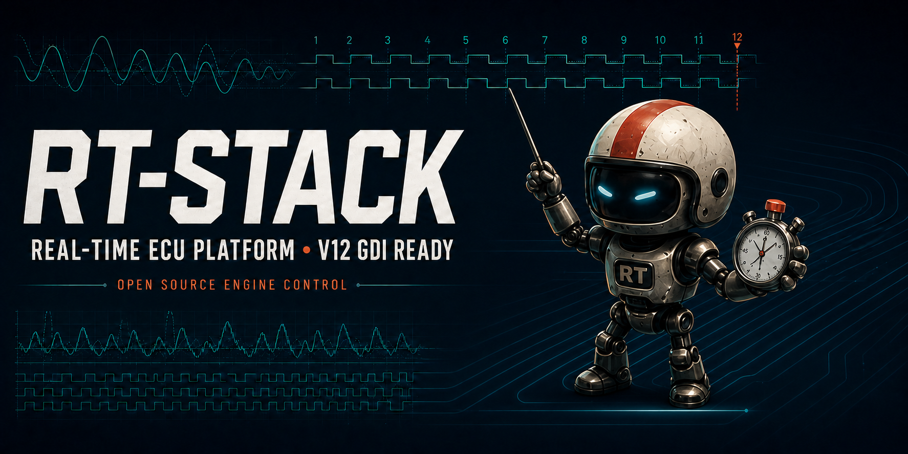

<p align="center">
  
</p>

# RT-STACK

**RT-STACK is an open-source, real-time engine-control platform for experimental, motorsport, and bench-development applications.** It combines a deterministic STM32G4 real-time controller with the option to add a Raspberry Pi or another high-level computer for advanced control, data handling, and calibration workflows.

The hardware is deliberately ambitious—twelve injector channels, twelve ignition channels, trigger inputs, lambda interfaces, CAN, and a standard ECU connector—while the checked-in firmware is a transparent, configurable reference implementation. Start on the bench, understand every signal, then adapt the engine, trigger, and output configuration for your application.

> [!WARNING]
> RT-STACK is an engineering/development project. It is not certified, not road-legal, and is supplied without warranty. Do not connect coils, injectors, fuel pumps, or a running engine until you have independently validated the wiring, trigger decode, outputs, and failsafe behaviour on a safe bench setup.

## Why RT-STACK?

- **Real-time where it matters** — the STM32G474 handles time-critical trigger capture, injection and ignition scheduling.
- **Headroom where it helps** — a companion SBC can run high-level logic, graphical control models, logging, and calibration tooling without putting hard real-time output timing at risk.
- **Engine-agnostic by design** — the platform can be adapted for 2-stroke, 4-stroke, Wankel, Diesel, naturally aspirated, or forced-induction projects.
- **A serious hardware base** — the board is designed for high-channel-count PFI/GDI injection, inductive ignition, trigger sensing, lambda control, and general-purpose outputs.
- **Open calibration path** — the wider FUPSRL toolchain supports CAN/XCP workflows and A2L/HEX artefacts for tools such as ETAS INCA and Vector CANape. The current firmware also includes a 500 kbit/s classic-CAN status message and its DBC.

## Architecture

```text
Crank / cam / sensors
        │
        ▼
STM32G474 real-time layer ──► injector, ignition and I/O drivers
        │                         ▲
        ├── CAN telemetry          │ deterministic time-critical control
        ▼                         │
Optional SBC / high-level layer ──┘
  control logic · logging · calibration · user interface
```

The STM32 is the safety- and timing-critical controller. A companion computer is optional and should be treated as a supervisory layer, not as a replacement for deterministic output control.

## Hardware capabilities

| Area | Capability |
| --- | --- |
| Fuel | 12 injector drivers, intended for general-purpose GDI or PFI use; high-voltage DC/DC injector drive and current sensing |
| Ignition | 12 inductive-spark channels |
| Position sensing | 9 general-purpose trigger interfaces for crank, cam, turbo speed, or other timing inputs |
| Lambda | 2 × CJ125 lambda-controller interfaces |
| Outputs | 12 general-purpose outputs with selectable push/pull behaviour |
| Communications | FDCAN-capable MCU; the checked-in project configures classic CAN at 500 kbit/s and includes two UARTs |
| Processor | STM32G474VETx, with analogue comparators and DAC thresholds for injector-drive control |
| Integration | 186-pin standard ECU connector; designed to stack with a Raspberry Pi breakout board for high-level control |

Selected devices include the STM32G474VETx, ACS722 current sensing, CJ125 lambda interfaces, IR2101/TC4427 gate drivers, RGPR30BM40 ignition IGBTs, and IFX007TAUMA1 push/pull drivers. Consult the KiCad design and BOM before making any electrical decision; this README is an overview, not a wiring specification.

## Firmware: current scope

The firmware project lives in [`SW/RT_STACK_V2`](SW/RT_STACK_V2) and is an STM32CubeIDE / STM32CubeMX project. It provides a clear reference structure rather than a sealed, generic binary:

- **Trigger capture and decoding** — trigger edges are timestamped with the DWT cycle counter. The included decoder is configured for a 60-2 crank wheel, optional cam recognition, and 0–720° phase fusion.
- **Engine configuration** — cylinder count, firing order, ignition/injector channel mapping, dwell limit, boost time, and comparator thresholds are centralised in [`engine_config.h`](SW/RT_STACK_V2/Core/Inc/engine_config.h).
- **Trigger configuration** — crank-wheel and cam-pattern settings are centralised in [`trigger_decoder_config.h`](SW/RT_STACK_V2/Core/Inc/trigger_decoder_config.h).
- **Output scheduling** — [`spark.c`](SW/RT_STACK_V2/Core/Src/spark.c) and [`injection.c`](SW/RT_STACK_V2/Core/Src/injection.c) schedule the configured engine channels.
- **Telemetry** — `RT_Status` is sent as an 8-byte classic-CAN frame at identifier `0x100` every 10 ms; [`RT_STACK_V2.dbc`](SW/RT_STACK_V2/RT_STACK_V2.dbc) describes that message.

The committed engine calibration is an **inline-four example** (firing order `1-3-4-2`) and is not a V12 calibration. V12 readiness describes the available I/O architecture; you must supply a correctly validated configuration for every target engine.

## Quick start — safe development workflow

1. Clone the repository and open [`SW/RT_STACK_V2`](SW/RT_STACK_V2) in STM32CubeIDE. The `.ioc` file retains the CubeMX peripheral configuration.
2. Read `engine_config.h` and `trigger_decoder_config.h` before connecting any engine hardware. Configure only a bench-known target first.
3. Build the **Debug** configuration and flash through a correctly wired ST-LINK connection.
4. With injectors and coils disconnected, verify power rails, CAN traffic, trigger-edge polarity, decoded crank angle, RPM, and cam phase using instruments you trust.
5. Validate each output with suitable loads or test fixtures. Add engine actuation only after the whole chain has been checked.

For a guided explanation of the architecture, firmware configuration, CAN telemetry, calibration direction, and bench validation, read the [RT-STACK documentation](https://fupsrl.com/docs/rt-stack-documentation-v1/).

## Repository layout

| Path | Contents |
| --- | --- |
| [`HW`](HW) | KiCad hardware design files |
| [`FAB`](FAB) | Fabrication/manufacturing material |
| [`SW/RT_STACK_V2`](SW/RT_STACK_V2) | STM32CubeIDE firmware project, DBC, source, and CubeMX configuration |
| [`assets`](assets) | Repository artwork, including this README banner |

## Hardware preview

<p align="center">
  
  
</p>

## Calibration and companion tools

RT-STACK is designed to sit within a broader open tooling workflow. The [CM-STACK Simulink Compiler](https://github.com/fupsrl/CM-STACK-Simulink-Compiler) creates deployable generic-Linux applications and calibration artefacts, while [INCAZ](https://github.com/fupsrl/INCAZ) is a lightweight measurement, calibration, and flash client. Treat each integration as a separately validated engineering step.

## Contributing and support

Issues and pull requests are welcome, especially reproducible trigger-decoder tests, documentation corrections, and validated engine configurations. Please include the RT-STACK revision, firmware commit, engine/trigger setup, power supply conditions, and the measurements or logs that demonstrate the behaviour.

## License

RT-STACK is licensed under [Creative Commons Attribution-NonCommercial 4.0 International](LICENSE.txt). Attribution is required and commercial use is not permitted.
